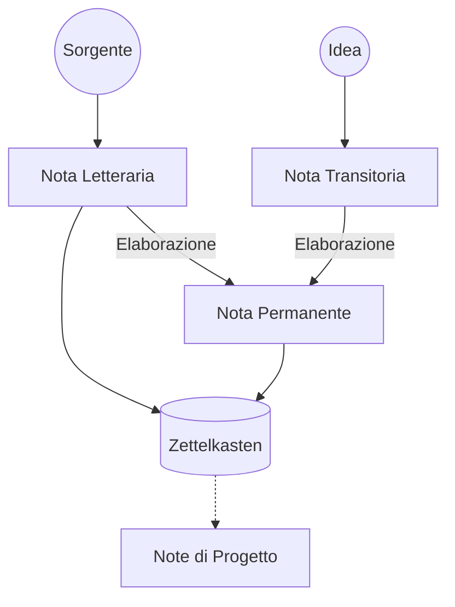

Il seguente diagramma riassume il flusso di entrata delle note che compongono uno [[Zettelkasten]]:

Ci sono tre tipi di note:
- **transitorie**: appunti di idee volanti, pensieri non strutturati, etc
- **permanenti**:
	- **letterarie**: appunti su materiale letto, con riferimenti bibliografici
	- **zettel**: rielaborazione dei concetti con parole proprie, rispetto al criterio di [[atomicità]] e [[interconnessione]]
- **di progetto**: note scritte per un progetto e scartate al suo termine
	- commenti agli scritti
	- collezioni di letteratura legata al progetto
	- outline
	- stralci di bozza
	- promemoria
	- liste di cose da fare

# Sorgenti

- Ahrens, Sönke. *How to take Smart Notes*, CreateSpace, 2017

