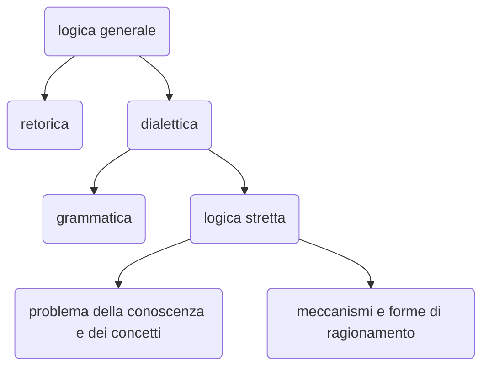

```mermaid
graph TD;
	A(logica generale) --> B(retorica);
	A(logica generale) --> C(dialettica);
	C(dialettica) --> D(grammatica);
	C(dialettica) --> E(logica stretta);
	E(logica stretta) --> F(problema della conoscenza e dei concetti);
	E(logica stretta) --> G(meccanismi e forme di ragionamento);
```

